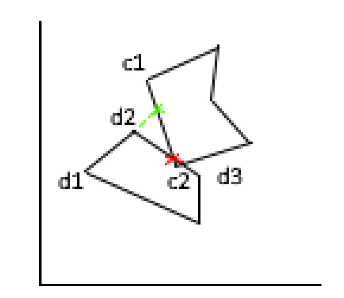

# Documentatie space invaders, door Matthias van Herk

In dit bestand staat de documentatie van een namaak versie van het spel space invaders, ontwikkeld door Matthias van Herk.
<br>
laatst gewijzigd: 31/10/2023, versie: 1.6

# spelomschrijving

## Spelwereld
Wanneer de speler het spel opstart ziet deze een ruimte achtergrond met daarin een aantal rijen en kolommen vijanden en een speler.

## Speler
het ruimteschip onderaan het scherm is de speler. Druk op de desbetreffende pijltjestoetsen om de speler naar links en rechts te laten bewegen. Druk op de spatiebalk om een kogel af te schieten.

## Vechten
Wanneer een kogel iets raakt verdwijnt deze. Als een speler-kogel een vijand raakt verdwijnt de vijand. Als een vijand-kogel de speler raakt verliest de speler een leven. De speler heeft 3 levens. Als de speler geen levens meer, dan is het spel voorbij en verliest de speler. Als alle vijanden weg zijn en de speler leeft nog, dan wint de speler. Er zijn schietende vijanden en vijanden zonder speciale aanvallen.

## score
Wanneer de speler een vijand neerschiet krijgt de speler punten. Eens in de zoveel tijd vliegt er een ufo over die extra punten oplevert wanneer deze neergeschoten wordt. Aan het eind krijgt de speler zijn score te zien en de mogelijkheid om opnieuw te beginnen.

## game over
aan het einde van het spel mag de speler hun naam invoeren om deze samen met de score op te slaan in de database. Hierna ziet de speler de top 10 highscores op het scherm verschijnen.

# technisch gedoe

## standaard code

### preload
Er worden een aantal sprites geladen zodat het spel er mooi uitziet.

### setup
De spelwereld en speler worden gemaakt door een rectangle te tekenen en in te kleuren. De vijanden worden met een dubbele for-loop in rijen en kolommen getekend en toegevoegd aan de enemies array. 

### loadLevel en unloadLevel
Er zijn functies die ervoor zorgen dat het level aan het begin van het spel geladen wordt en aan het einde van het spel weer verwijderd wordt zodat je opnieuw kan spelen en meerdere levels kan toevoegen.

### spawnEnemies en spawnShields
Deze  functies zorgen ervoor dat aan het begin van het level een aantal shields en een aantal vijanden gemaakt worden. Deze functies worden ook aangeroepen elke keer als het level geladen wordt.

### speler
De speler kan heen en weer bewegen en schieten. Door de functies keyPressed en keyReleased wordt gekeken welke knoppen ingedrukt worden. keyIsPressed te gebruiken en de juiste keyCodes te checken. Wanneer een toets wordt ingedrukt wordt ook gekeken of de speler niet buiten het scherm gaat in de if-statement. Er zit een cooldown op het schieten die door het gebruik van deltaTime 3 seconden cooldown heeft.

### vijanden
Wanneer de vijanden de zijkanten van het scherm raken gaat deze enemy door een loop heen om elke vijand in enemies van richting te laten veranderen en naar beneden te laten springen. Er wordt een boolean direction gebruikt om te zorgen dat de vijanden niet meerdere keren van richting veranderen en naar beneden springen wanneer meerdere vijanden tegelijk de rand van het scherm raken. Om de zo veel tijd schieten de vijanden een kogel naar beneden. Als een vijand geraakt wordt door een kogel van de speler wordt deze toegevoegd aan de splicedEnemies array zodat deze later wordt verwijderd.

### ufo
Elke random hoeveelheid tellen spawnt er een ufo, die random van links of rechts kan komen, boven aan het scherm en vrij snel naar de andere kant beweegt en dan verdwijnt.

### turn
de functie turn zorgt ervoor dat alle vijanden tegelijkertijd omdraaien en naar beneden springen.

### colliders
Er is een collider class die de locatie en grootte van twee objecten neemt en dan als true terugkomt wanneer deze objecten elkaar raken. 

### bullets
De vijanden en speler kunnen beide kogels maken. Als de speler een kogel schiet vernietigd deze vijanden als ze elkaar raken, wat gecheckt wordt met behulp van een collider. Als een kogel een vijand raakt verdwijnt de kogel. Als een vijand een kogel schiet en deze de speler raakt verliest de speler een leven en verdwijnt de kogel.

### shields
Er spawnen aan het begin van het spel een aantal shields op een bepaalde afstand van de speler en blijven op die plaats stilstaan tot ze kapot geschoten worden, waarna ze verdwijnen. De schilden gaan kapot door beide speler en vijand kogels. De variabelen van de schilden kunnen aangepast worden zonder dat deze buiten het scherm spawnen. Je kan meer of minder schilden maken, ze verder uit elkaar laten spawnen, de grootte van de schilden en de  grootte van de speler aanpassen zonder dat dit raar gaat doen(tenzij je de speler het hele scherm maakt misschien).
```javascript
function spawnShields()
{
  let distanceBetweenShields = (shieldBoundingBox - (numberOfShields * shieldSizeX)) / (numberOfShields - 1);

  //creates shields that can be changed in distance and size and will still function
  for(let i = 0; i < numberOfShields; i++)
  {
    shield = new Shield((i * distanceBetweenShields) + (i * shieldSizeX) + (width - shieldBoundingBox)/2, player.y - player.height - 20 - shieldSizeY);
    shields.push(shield);
  }
}

```

### destroyer
Er is een destroyer class die langs alle objecten gaat in de splicedBullets en splicedEnemies arrays en deze vernietigd. Er is ook een variabele destroyedNumberOfEnemies die ervoor zorgt dat de juiste vijanden verwijderd worden wanneer er meer dan 1 vijand tegelijk dood gaat.

## herbruikbare code
in het spel heb ik op verschillende manieren code gemaakt die herbruikbaar is zodat er minder code is en er dus ook minder ruimte is voor fouten. Er is een collider class. De collider class krijgt van twee objecten de locatie en grootte van het object en kijkt dan wanneer deze elkaar raken.

```javascript
class Collider
  {
    //constructs collider
    constructor(ax, ay, awidth, aheight, bx, by, bwidth, bheight)
    {
      this.ax = ax;
      this.ay = ay;
      this.bx = bx;
      this.by = by;
      this.awidth = awidth;
      this.aheight = aheight;
      this.bwidth = bwidth;
      this.bheight = bheight;
    }


    colliderDetector()
    {
      //detects if object a and object b collide
      if(((this.ax + this.awidth) >= this.bx)
      && (this.ax <= (this.bx + this.bwidth))
      && ((this.ay + this.aheight) >= this.by)
      && (this.ay <= (this.by + this.bheight)))
      {
        return true;
      }
    return false;
    }
  }
```

Er is ook een destroyer functie deze kijkt naar alle elementen in de splicedEnemies array en verwijdert deze dan een voor een.

```javascript

function destroyer()
{
  let destroyedNumberOfEnemies = 0;
  //destroys all enemies that are in the splicedEnemies array
  while(splicedEnemies.length > 0)
  {
    enemies.splice(splicedEnemies[0], 1);
    splicedEnemies.splice(0, 1);
    destroyedNumberOfEnemies += 1;
    if(splicedEnemies.length > 0)
    {
      splicedEnemies[0] -= destroyedNumberOfEnemies;
    }
  }

  //destroys all bullets that are in the splicedBullets array
  while(splicedBullets.length > 0)
  {
    bullets.splice(splicedBullets[0], 1);
    splicedBullets.splice(0, 1);
  }
}

```

## database

### Highscore
de highscore class bewaart de naam en score van de speler.

### onHighscoreSaved
deze functie wordt uitgevoerd wanneer de highscore van de speler is opgeslagen en voert daarna de onHighscoreRetrieved functie uit

### onHighscoreRetrieved
Deze funtie vult een array met alle highscores en namen zodat deze omgezet kan worden in een top 10 van de beste spelers.


hieronder staat de code hoe ik mijn highscores opsla en ophaal van de database, waarbij ik gebruik heb gemaakt van de kennissessie.
```javascript
httpGet(`${saveDataUrl}?game=${gameId}&name=${playerName}&score=${score}`, onHighscoreSaved);
```
in het bovenstaande stukje staat hoe ik de naam en score opsla en daarna voert hij de functie onHighscoreSaved uit.

```javascript
//does things when the highscore is saved
function onHighscoreSaved()
{
  loadJSON(`${loadDataUrl}?game=${gameId}`, onHighscoreRetrieved);
}


//does things when the highscores have been retrieved
function onHighscoreRetrieved(dataAsJson)
{

  //adds the highscore name and score to an array
  for(let i = 0; i < dataAsJson.length; i++)
  {
    highscore = new Highscore();
    highscore.name = dataAsJson[i].name;
    highscore.score = dataAsJson[i].score
    highscores.push(highscore);
  }
  highscoreRetrieved = true;
}


//used to save the name and score of all players
class Highscore
{
  construstor(name, score)
  {
    this.name = name;
    this.score = score;
  }
}
```

## AdvancedCollider

### uitleg
Ik heb een polygon collider gemaakt, een collider die gebruik maakt van een aantal lijnsegmenten om zo een heel specifieke vorm te kunnen maken. Ik heb dit gedaan door de x en y waarden van de hoeken van een object mee te geven. Hierna heb ik met behulp van deze hoeken de lijnen berekend door ze in een y = ax + b formule om te zetten. Hierna berekende ik waar de lijnen van object A botste met de lijnen van object B door de formules gelijk te stellen. Als laatste om echt te kijken of de twee objecten botsten checken we of de coordinaten waar de twee lijnen botsen binnen de hoeken van beide objecten, waarmee de lijnen zijn opgesteld, vallen.

In het onderstaande plaatje is iets duidelijker te zien wat ik precies bedoel. Hier zijn de rode en groene kruisjes de kruisingen tussen de lijnen. C1 en c2 maken de lijn van object A. d1 en d2, en d2 en d3 maken de lijnen van object B. d1d2 geven geen collision terug omdat deze kruising niet binnen de hoeken van d1d2 vallen, terwijl dat bij d2d3 met c1c2 wel het geval is.
<br>


### code
ik heb functies gemaakt die de hoeken van een object nodig hebben en daarmee dan de lijnen tussen de hoeken berekenen.
```javascript
this.advancedCollider.setObjectA(
      colliderArrayMeter(bulletCornersXStart.length, bulletCornersXStart, bulletCornersYStart, false, this.x, this.y).x,
      colliderArrayMeter(bulletCornersXStart.length, bulletCornersXStart, bulletCornersYStart, false, this.x, this.y).y);
```
zoals hierboven moet je de waarden aan een object geven door het aantal hoeken op te geven, de x waarden van de hoeken en de y waarden van de hoeken op te geven, dan of het object B is of niet en als laatste de x en y positie van het object.

hierbij zet ik eerst de coordinaten van de hoeken in een array. Hierna kijkt ik of er nog waarden in de array staan van een vorig object dat meer hoeken had en worden deze overige hoeken verwijderd. Door de verschillen in x en y waarden van elkaar af te trekken zetten we het verschil tussen de waarden waarvan we door y/x te doen de groeiwaarde van de formule. door de formule y = ax + b om te bouwen en de waarden van een hoek te gebruiken kunnen we de offset (het punt waar de lijn door de y-as gaat) berekenen.

dit doen we vrijwel exact hetzelfde met object B.
```javascript
setObjectA(cornersAX, cornersAY)
  {

    //sets the corners of object A
    for(let i = 0; i < cornersAX.length; i++)
    {
      let x = cornersAX[i];
      let y = cornersAY[i];
      cornersA.splice(i,1,createVector(x, y));

      //makes sure that if a new object has more corners than the last one, it doesn't use more corners than it has
      if(cornersA.length > cornersAX.length)
      {
        cornersA.length = cornersAX.length;
      }
    }

    //loops for every corner object A has. calculates the lines between two corners
    for(let i = 0; i < cornersA.length; i++)
    {

      //makes sure the last line uses the last and first corner to create a line
      if(i+1 >= cornersA.length)
      {
        aDeltaY = cornersA[0].y - cornersA[i].y;
        aDeltaX = cornersA[0].x - cornersA[i].x;
      }

      else
      {
        aDeltaY = cornersA[i+1].y - cornersA[i].y;
        aDeltaX = cornersA[i+1].x - cornersA[i].x;
      }
      aGrow = (aDeltaY/aDeltaX);
      aGrowths.splice(i, 1, aGrow);
      aYAxisOffset = cornersA[i].y - (cornersA[i].x * aGrow);
      aYAxisOffsets.splice(i, 1, aYAxisOffset);
    }
  }

```

Voor elke lijn van object A moeten we kijken waar deze kruist met elke lijn van object B (voor elke hoek is er een lijn). We berekenen de kruising van de X door de formules y = ax + b gelijk te stellen. Dit doen we zo:
y = ax + b = cx + d
x = (b - d) / (a - c)

de y waarde berekenen we vrij makkelijk door de waarde van de kruising van x nu in de formule in te vullen samen met de waarden van een van de lijnen.

Door de manier waarop ik de lijnen heb berekent kan het zijn dat de groei oneindig of nul is wanneer de lijn parallel aan de x- of y-as is waardoor de formules niet meer werken. Om dit op te lossen heb ik gekeken of de waarden van de kruising van de lijnen een nummer zijn, en wanneer dit niet waar is betekent het dat het een horizontale of verticale lijn is en de x of y dus exact hetzelfde is als de hoek zelf en heb de kruising waarde hierop gezet.

Als laatste komt het checken of de waarden binnen de hoeken van de lijnsegmenten vallen. Ik heb hier Math.min en Math.max gebruikt om te kijken welke waarde hoger is. Hierna komen een hele hoop checks om te kijken of een van de hoeken de laatste hoek van het object is aangezien de lijn dan moet worden opgesteld in combinatie met de eerste hoek. Wanneer er een collision gedetect is returnt de functie met true en anders met false.

```javascript
update()
  {

    //checks collision for every line in object A with every line in object B
    for(let i = 0; i < cornersA.length; i++)
    {

      for(let j = 0; j < cornersB.length; j++)
      {
        crossingX = (aYAxisOffsets[i] - bYAxisOffsets[j]) / -(aGrowths[i] - bGrowths[j]);

        //when A line is parallel to the X- or Y-Axis the growth could be infinite or the axisoffset could be non-existant
        //this sets the crossingX to the X of the corner if the line is parallel to the Y-axis.
        if(isNaN(crossingX))
        {
          if(aGrowths[i] == Infinity || aGrowths[i] == -Infinity)
          {
            crossingX = cornersA[i].x;
          }
          else
          {
            crossingX = cornersB[i].x;
          }
        }
        crossingY = bGrowths[j] * crossingX + bYAxisOffsets[j];

        //if the line is parallel to the X-axis then this sets the y crossing to the y value of the corner.
        if(isNaN(crossingY))
        {
          crossingY = cornersA[i].y
        }

        //makes sure the corners are on the rigth side of the other object.
        if(i+1 < cornersA.length && j+1 < cornersB.length)
        {
          let minAX = Math.min(cornersA[i].x, cornersA[i+1].x);
          let maxAX = Math.max(cornersA[i].x, cornersA[i+1].x);
          let minBX = Math.min(cornersB[j].x, cornersB[j+1].x);
          let maxBX = Math.max(cornersB[j].x, cornersB[j+1].x);

          let minAY = Math.min(cornersA[i].y, cornersA[i+1].y);
          let maxAY = Math.max(cornersA[i].y, cornersA[i+1].y);
          let minBY = Math.min(cornersB[j].y, cornersB[j+1].y);
          let maxBY = Math.max(cornersB[j].y, cornersB[j+1].y);

          //checks for collision between object A and B.
          if((crossingX <= maxAX && crossingX >= minAX && crossingX <= maxBX && crossingX >= minBX) && (crossingY <= maxAY && crossingY >= minAY && crossingY <= maxBY && crossingY >= minBY))
          {
            return true;
          }
        }

        //makes sure the corners are on the rigth side of the other object.
        else if(i+1 >= cornersA.length && j+1 < cornersB.length)
        {
          let minAX = Math.min(cornersA[i].x, cornersA[0].x);
          let maxAX = Math.max(cornersA[i].x, cornersA[0].x);
          let minBX = Math.min(cornersB[j].x, cornersB[j+1].x);
          let maxBX = Math.max(cornersB[j].x, cornersB[j+1].x);

          let minAY = Math.min(cornersA[i].y, cornersA[0].y);
          let maxAY = Math.max(cornersA[i].y, cornersA[0].y);
          let minBY = Math.min(cornersB[j].y, cornersB[j+1].y);
          let maxBY = Math.max(cornersB[j].y, cornersB[j+1].y);

          //checks for collision between object A and B.
          if((crossingX >= minAX && crossingX <= maxAX && crossingX <= maxBX && crossingX >= minBX) && (crossingY <= maxAY && crossingY >= minAY && crossingY <= maxBY && crossingY >= minBY))
          {
            return true;
          }
        }

        //makes sure the corners are on the rigth side of the other object.
        else if(i+1 < cornersA.length && j+1 >= cornersB.length)
        {
          let minAX = Math.min(cornersA[i].x, cornersA[i+1].x);
          let maxAX = Math.max(cornersA[i].x, cornersA[i+1].x);
          let minBX = Math.min(cornersB[j].x, cornersB[0].x);
          let maxBX = Math.max(cornersB[j].x, cornersB[0].x);

          let minAY = Math.min(cornersA[i].y, cornersA[i+1].y);
          let maxAY = Math.max(cornersA[i].y, cornersA[i+1].y);
          let minBY = Math.min(cornersB[j].y, cornersB[0].y);
          let maxBY = Math.max(cornersB[j].y, cornersB[0].y);

          //checks for collision between object A and B.
          if((crossingX >= minAX && crossingX <= maxAX && crossingX <= maxBX && crossingX >= minBX) && (crossingY <= maxAY && crossingY >= minAY && crossingY <= maxBY && crossingY >= minBY))
          {
            return true;
          }
        }

        //makes sure the corners are on the rigth side of the other object.
        else if(i+1 >= cornersA.length && j+1 >= cornersB.length)
        {
          let minAX = Math.min(cornersA[i].x, cornersA[0].x);
          let maxAX = Math.max(cornersA[i].x, cornersA[0].x);
          let minBX = Math.min(cornersB[j].x, cornersB[0].x);
          let maxBX = Math.max(cornersB[j].x, cornersB[0].x);

          let minAY = Math.min(cornersA[i].y, cornersA[0].y);
          let maxAY = Math.max(cornersA[i].y, cornersA[0].y);
          let minBY = Math.min(cornersB[i].y, cornersB[0].y);
          let maxBY = Math.max(cornersB[i].y, cornersB[0].y);

          //checks for collision between object A and B.
          if((crossingX >= minAX && crossingX <= maxAX && crossingX <= maxBX && crossingX >= minBX) && (crossingY <= maxAY && crossingY >= minAY && crossingY <= maxBY && crossingY >= minBY))
          {
            return true;
          }
        }
        else
        {
          return false;
        }
      }
    }
  }
```


### fragBullet

Ik heb een fragBullet gemaakt. Een bullet die na een random korte tijd explodeert in drie bullets die allemaal een andere kant op schieten. De fragbullet is een subclass van de gewone bullet, net als de fragmentations die de fragbullet creeert. de fragbullet werkt vrijwel hetzelfde als de standaard bullet, maar nadat de timer afgelopen is maakt deze drie nieuwe bullets waarvan een naar links beweegt, een gewoon naar beneden gaan, en een naar rechts beweegt. 

voor de fragmentation heb ik gebruik gemaakt van de translate en rotate functies die ingebouwd zijn in p5, zodat de afbeelding gedraaid zou worden. hierna heb ik nog veel gedoe gehad met zorgen dat de kogels allemaal de juiste kant op gingen en vooral ook dat de collider op dezelfde plek als de tekening was, aangezien de translate en rotate functies de hele as verplaatsen en draaien werkte de afbeeldingen op een andere as dan de collider. Om dit op te lossen heb ik uiteindelijk berekent wat het verschil tussen de twee assen was en dat verschil toegevoegd aan de coordinaten van de tekeningen.

