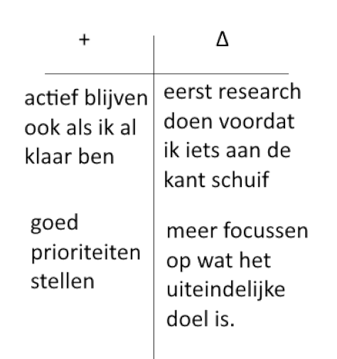

# retrospectives

## retrospective 1
Deze sprint zijn we bezig geweest met werken volgens de agile methodiek. In de eerste paar dagen had ik een verwachting gemaakt van hoever ik aan het eind van de sprint zou zijn gebasseerd op de tijd die ik had en de progressie die ik tot dan toe al had gemaakt. Deze planning leek vrij goed overeen te komen met de realiteit en het is me gelukt om alles op tijd af te krijgen, waarbij ik nog extra tijd had om verschillende elementen te verbeteren en bugs op te lossen.
 
Ik ben tevreden over hoe ik te werk ben gegaan. Ik keek in het begin vaak naar de aangegeven links die bij de opdrachten zouden helpen, maar naarmate ik meer userstories maakte lukte het steeds meer om de problemen volledig zelfstandig op te lossen. Ik had niet veel problemen met echt actief werken wanneer ik dat wilde en had alleen zo nu en dan als ik ergens op vast liep dat ik daardoor net uit mijn werkflow raakte. Ik heb hierdoor wel gemerkt dat het voor mij goed werkt om op zo'n moment even buiten de situatie te stappen en een tijdje later er opnieuw naar te kijken waarmee ik vaak al snel de oplossing vind. Verder moet ik wel iets meer letten op de learning stories omdat ik daar niet heel veel aan heb gewerkt.

### feedback

Mijn medestudenten vonden het goed dat ik al bezig was geweest met het verwerken van eerder verkregen feedback. Verder raadden ze aan om op te letten met het uitstellen van vervelendere taken, zoals bugfixen en documenteren omdat dat ervoor kan zorgen dat je minder motivatie krijgt om verder te gaan.

### retro kit

+
 
Ik wil verder gaan met hoe ik het afgelopen sprint heb aangepakt, door een inschatting te maken van wat ik kan doen tijdens de sprint. Ook lijkt mijn aanpak van problemen goed te werken voor mij, dus wil ik hiermee doorgaan voor de komende sprint. Ik moet daarmee wel opletten dat ik niet te vaak tegen problemen aan loop waardoor ik langere tijd niet verder kom.

Δ
 
Ik wil deze sprint proberen de vervelendere taken wat beter te verdelen zodat ik makkelijker doorwerk. Verder wil ik proberen om in ieder geval een keer per week te kijken of ik iets aan de learning stories kan doen zodat ik dat niet aan het einde nog allemaal langs hoef te lopen.

## retrospective 2
Voor de tweede sprint ben ik bezig geweest met het overige deel van de userstories. Origineel had ik gepland om de game volledig functionerend te krijgen, oftewel alle user stories rondom scores, levens en nog wat bugfixes te doen, maar ik was hier veel sneller mee klaar dan verwacht en ben daarna steeds verder gaan kijken hoe ver ik kon komen met de user stories die ik over had gelaten voor sprint 3. Ik begon met alle sprites tekenen en ervoor zorgen dat het spel er ook echt uitzag als een spel in plaats van een hoop bewegende blokjes. Hierna hadden we de kennissessie over databases gevolgd en kon ik daar ook mee verder werken waardoor ik uiteindelijk alle user stories heb kunnen afronden.
  
deze sprint ben ik beter te werk gegaan met de verdeling van taken en heb ik eerder de tijd genomen om mijn documentatie bij te werken en heb ik alle bugs meteen gefixt wanneer ik die tegenkwam waardoor ik dat niet allemaal aan het einde moet doen. Ik moet wel wat beter letten op mijn learning stories en feedback van vorige sprint aangezien ik daar vrijwel niet naar heb gekeken deze sprint.

### feedback
Mijn medestudenten vinden het goed dat ik naast mensen helpen ook nog de tijd vind om zelf goed te werken. Ze vinden ook dat ik goed in staat ben om op mijzelf te reflecteren. Verder hadden ze geen op of aanmerkingen aan mijn werkwijze.

### retro kit

+
 
Ik heb deze sprint de soorten taken goed verdeeld waardoor ik niet op een moment nog alle minder leuke dingen moest doen. Verder maak ik goede progressie en moet ik zorgen dat ik dat vast hou door zelf ideeen toe te voegen.

Δ
 
Ik wil komende sprint wel echt kijken hoe ver ik ben met de learning stories en wat ik daar nog aan moet doen. Beter opletten dat ik geen feedback vergeet en fouten herhaal van de vorige sprint.

## retrospective 3
### introductie
Deze laatste sprint Had ik als doel om een aantal extra mechanics toe te voegen. Uiteindelijk is het me niet gelukt om alles wat ik wilde implementeren ook echt in de game te maken. Ik had gepland om nog geluiden toe te voegen en nog het spawnen van de nieuwe enemy die ik heb gemaakt goed te implementeren, maar ik had hier geen tijd meer voor omdat ik de hoeveelheid werk, die nodig was voor mijn eerste ideeen, had onderschat. Ik ben deze sprint wel bezig geweest met het maken van een nieuwe vijand die kogels schiet die na een korte tijd exploderen in drie nieuwe kogels die als een soort shotgun uitspreiden. Omdat mijn kogels langwerpig zijn heb ik de sprites van mijn kogels gedraaid zodat het er natuurlijker uitziet, maar hiervoor en in combinatie met mijn nieuwe sprites was het nodig om een nieuwe collider te maken zodat het spel niet oneerlijk zou voelen. 

#### vorige sprint
 
Mijn vorige retrospective kreeg ik voornamelijk als feedback dat ik moest werken aan de leesbaarheid van mijn document, ik heb geprobeerd dat deze keer te verbeteren door wat meer kopjes toe te voegen. Verder kreeg ik ook als feedback dat ik deze sprint zelf user stories kon toevoegen wat ik ook heb gedaan.
Verder hadden mijn squadgenoten niet veel feedback wat ik kon verbeteren vorige keer, maar ik ben zelf wel meer gaan kijken naar learningstories zoals ik zelf had opgeschreven in de vorige sprint(die hierboven te vinden is).

#### tijdsbesteding
 
Naar deze collider is een erg groot deel van mijn tijd gegaan. Nadat ik al vrij snel een idee had hoe ik het wilde aanpakken moest ik weer een redelijke hoeveelheid kennis over formules ophalen. Verder ontstonden er ook steeds meer bugs en uitzonderingen op hoe ik origineel had bedacht om het op te lossen, waardoor ik met deze collider alleen al twee hele weken bezig was totdat het uiteindelijk geheel geimplementeerd was.

#### reflectie
 
Ik heb deze sprint dus overschat wat ik klaar zou kunnen krijgen. Dit kwam naar mijn idee vooral ook omdat ik te ambitieus was naar hoe ik wilde dat mijn eindproduct eruit ging zien. Ik probeerde een volledige game te maken terwijl dat natuurlijk niet het uiteindelijke doel van de opdracht was. Ik ben wel erg blij met wat ik heb gemaakt aangezien ik mezelf heb uitgedaagd en het uiteindelijk toch gelukt is om alles werkend te krijgen. Ik merk wel dat wanneer ik ergens aan begin ik er constant mee bezig blijf totdat ik het af heb, wat voor problemen kan zorgen als ik een keer tegen een probleem aanloop wat ik niet kan oplossen of niet weet hoe ik het moet oplossen. Ik wil proberen om volgende keer eerst wat research te doen naar taken zodat ik een betere inschatting kan maken van hoeveel tijd ik eraan kwijt ga zijn en hoe moeilijk de taak wordt. Zelf wil ik ook kijken of ik wat meer kan kijken naar het geheel en daar een realistischer beeld voor kan creeeren waar ik later op uit kan bouwen in plaats van dat ik een idee heb voor het eindproduct wat niet haalbaar is.

### feedback

Binnen onze squad zijn wij begonnen met een samenvatting geven van hoe we te werk zijn gegaan en wat ons zelf al opviel aan onze werkwijze en werkhouding. Hierna gingen we tips en tops langs over wat misschien wat beter kon of waar iemand op moet letten.

#### tip
 Ik vertelde dat ik dingen als muziek en geluiden toevoegen aan mijn game oversloeg omdat dit mij redelijk makkelijk leek en ik daarom iets ging doen wat mij meer zou uitdagen zodat ik daar misschien al wat van mee kan nemen naar volgende periode. Een van mijn squadgenoten zei dat die hetgene wat ik oversloeg had geprobeerd en dat het toch wel wat moeilijker is dan het lijkt.
 Hierdoor gaven mijn squadgenoten mij de tip dat ik moet uitkijken dat ik niet te snel iets als makkelijk afschrijf en het dan uitstel waardoor ik later opeens erachter kom dat het toch moeilijker was dan ik had gedacht en in tijdnood kom. Dit wil ik oplossen door eerst een beetje research vooraf te gaan doen zodat ik wat beter een idee heb van wat ik precies moet doen.

#### top
Mijn squadgenoten vonden het goed dat ik mezelf uitdaag met moeilijkere mechanics zoals ik met mijn polygon collider heb gedaan. Verder hadden mijn squadgenoten niet veel aan te merken op wat er beter kon, dus dat neem ik ook mee als compliment.

### retro kit

